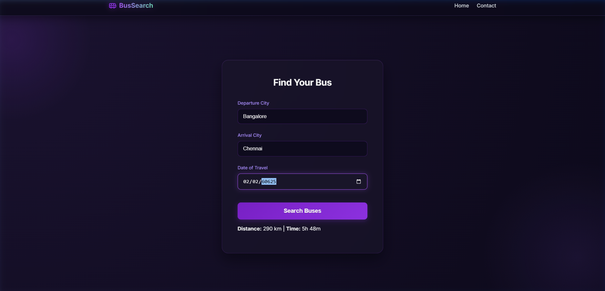
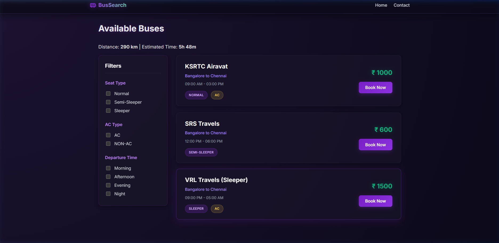
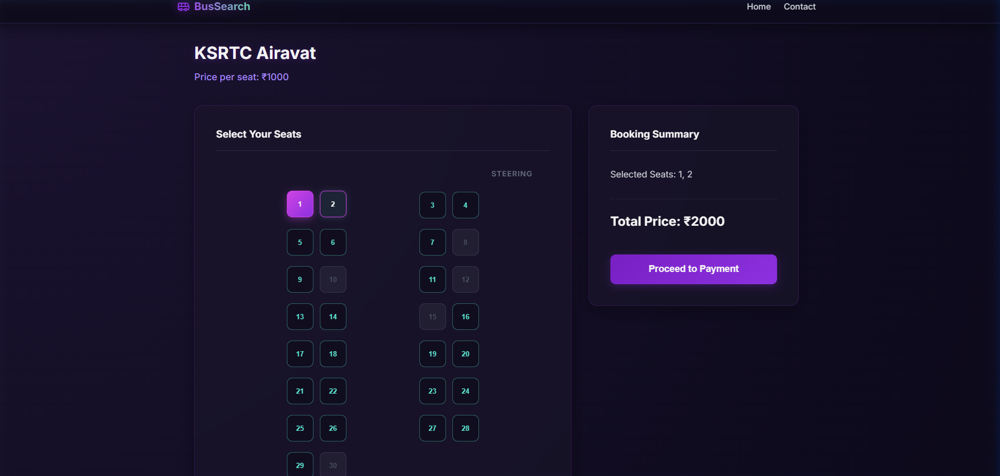
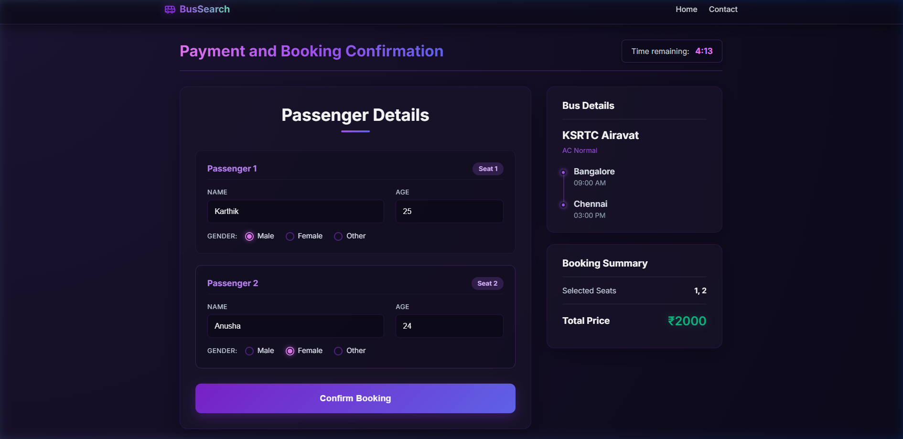
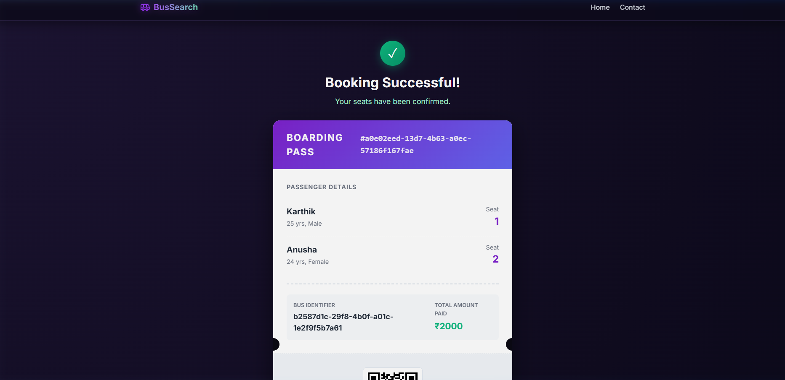
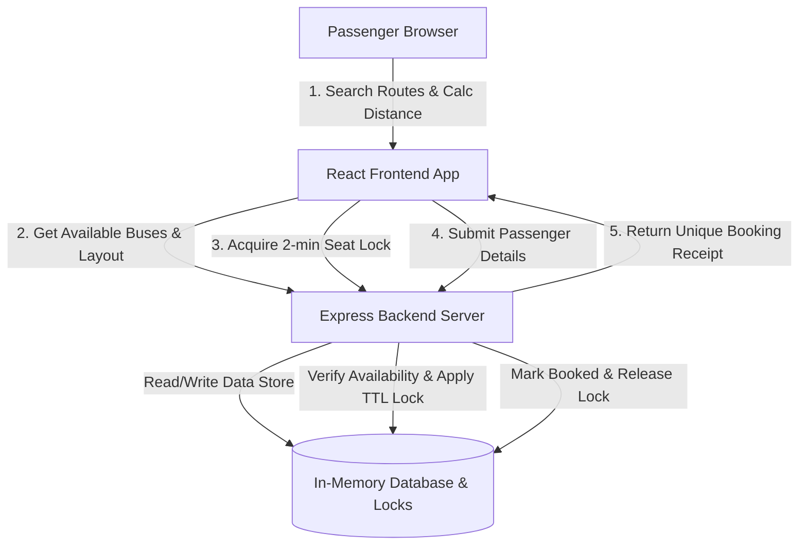

# 2.0 Bus - Modern Bus Booking Platform & Seating Engine

A high-performance, responsive, and beautifully designed web application and reservation engine for searching inter-city buses, selecting seats in real-time, and generating digital tickets. Built using a modern decoupled architecture: **React 19**, **TypeScript**, **Vite**, and **Node.js Express**.

This showcase repository demonstrates the project structure, clean architectural choices, and design aesthetics of the complete passenger-facing search and booking web application, without exposing proprietary configuration details or production environment variables.

---

## 📸 Interface Showcase

Below are actual screenshots of the application's user interface, displaying the dark-themed aesthetic, custom layouts, and interactive workflows:

### 1. Find Your Bus (Home Page)
An intuitive search portal featuring location autocomplete, calendar controls, and a real-time **Haversine Distance Calculator** that displays trip distance and estimated travel times dynamically.


### 2. Available Buses & Filters (Search Results)
A rich filtering interface allowing users to filter routes by AC/Non-AC types, specific seat configurations (Sleeper, Semi-Sleeper, Normal), and departure times (Morning, Afternoon, Evening, Night).


### 3. Interactive Seating Grid (Bus Details)
A responsive CSS Grid rendering of the bus layout including steering positions, seat-pairs, aisle gaps, and current availability. Selected seats are dynamically highlighted in real-time.


### 4. Passenger Details Confirmation
A streamlined checkout page mapping details (Name, Age, Gender) for each selected seat to validate boarding profiles.


### 5. Boarding Pass & Digital Receipt
The final ticket confirmation voucher, displaying the receipt, seat numbers, route info, and a unique transaction UUID.


---

## 🛠️ Technology Stack & System Architecture

The project is structured into two primary decoupled tiers:

1. **Passenger-Facing Client App (React + TypeScript + Vite)**:
   - Powered by **Vite** for sub-second hot module replacement (HMR) and optimized build bundles.
   - Styled using custom CSS with a dark neon theme, premium typography (**Inter**), and responsive layout components.
   - Dynamic date manipulation and query-string parameter state synchronizations.
   - Implements the **Haversine Formula** locally to calculate coordinates-based distances between Indian cities on demand.

2. **Decoupled REST API Backend (Node.js + Express + TypeScript)**:
   - Serves route schedules, pricing metadata, and active bus seat layouts.
   - Utilizes an **in-memory data-store** initialized with rich mock data.
   - Implements a **Transactional Seat Locking Mechanism** (2-minute TTL expiration) to avoid race conditions and double-bookings.

### Seat Locking Flow & System Architecture



---

## 📂 Codebase Directory Outline

```
bus-booking-showcase/
├── backend/                       # Express Node.js application
│   ├── src/
│   │   ├── controllers/
│   │   │   ├── bookingController.ts # Logic for seat locking and payment validation
│   │   │   └── busController.ts     # Filtering, search, and dynamic bus generator
│   │   ├── routes/
│   │   │   └── api.routes.ts        # REST endpoints declaration
│   │   ├── data.ts                  # Mock database & locking state manager
│   │   └── index.ts                 # Express configuration and listener
│   ├── package.json                 # Backend dev dependencies & scripts
│   └── tsconfig.json                # TypeScript compiler rules
├── frontend/                      # React SPA client application
│   ├── public/                      # Static assets & SVG icons
│   ├── src/
│   │   ├── assets/                  # Hero banners and background assets
│   │   ├── components/
│   │   │   ├── Navbar.tsx           # Global navigation header
│   │   │   └── Navbar.css
│   │   ├── data/
│   │   │   └── cities.ts            # Indian cities geo-coordinates dataset
│   │   ├── pages/
│   │   │   ├── HomePage.tsx         # Search card and distance indicator
│   │   │   ├── BusSearchPage.tsx    # List results & filter sidebar
│   │   │   ├── BusDetailsPage.tsx   # Visual seat layout grid
│   │   │   ├── BookingConfirmationPage.tsx # Checkout and passenger forms
│   │   │   └── TicketPage.tsx       # Receipt view
│   │   ├── utils/
│   │   │   └── distance.ts          # Haversine distance calculator
│   │   ├── App.tsx                  # Client router paths
│   │   ├── main.tsx                 # React DOM mount point
│   │   └── index.css                # Global styles and CSS variables
│   ├── package.json                 # Frontend build commands
│   ├── vite.config.ts               # Vite configuration
│   └── tsconfig.json                # App and Node ts configs
├── screenshots/                   # Captured workflow interface images
└── README.md                      # Project profile showcase documentation
```

---

## ⚡ Development Setup

### Prerequisites
- Node.js (version 18 or above)
- npm or yarn package manager

### Step 1: Install Dependencies
Navigate into both directories and install the packages:
```bash
# Install backend packages
cd backend
npm install

# Install frontend packages
cd ../frontend
npm install
```

### Step 2: Start the Servers
Launch the local servers in separate terminal instances:

```bash
# Start backend API (runs on port 3000)
cd backend
npm run dev

# Start frontend Client (runs on port 5173)
cd frontend
npm run dev
```

Open `http://localhost:5173/` in your browser to interact with the application.
